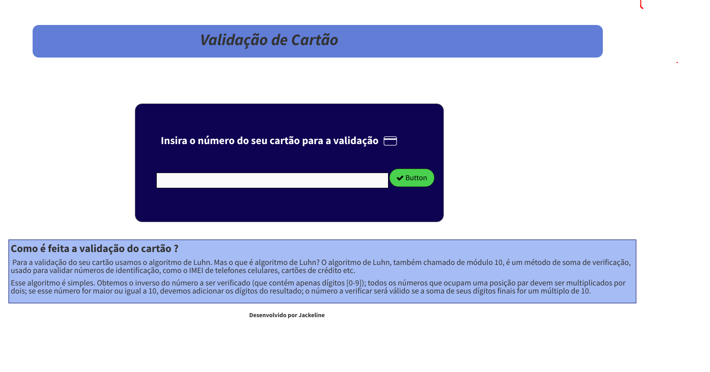

# Cartão de Crédito Válido

## Índice

- [1. Introdução](#1-Introdução)
- [2. Resumo do projeto](#2-resumo-do-projeto)
- [3. Objetivos de aprendizagem](#3-objetivos-de-aprendizagem)
- [4. Considerações gerais](#4-consideracoes-gerais)
- [5. Critérios de aceitação mínimos do projeto](#5-critérios-de-aceitação-mínimos-do-projeto)
- [6. Hacker edition](#6-hacker-edition)
- [7. Considerações técnicas](#7-considerações-técnicas)
- [8. Guias, dicas e leituras complementares](#8-guias-dicas-e-leituras-complementares)
- [9. Checklist](#9-checklist)

---

## 1. Introdução

## 2. Resumo do projeto

## 3. Objetivos de aprendizagem

## 5.

### Definição do produto

No `README.md`, conte-nos como você pensou sobre os usuários e qual foi seu
processo para definir o produto final a nível da experiência e da interface.

- Quem são os principais usuários do produto.
- Quais os objetivos destes usuários em relação a seu produto.
- Como você considera que o produto que está criando resolverá os problemas dos
  usuários.

### Interface do usuário (UI)

A interface deve permitir ao usuário:

- Inserir o número que desejamos validar.
- Constatar se o resultado é válido ou não.
- Ocultar todos os dígitos do número do cartão, exceto os últimos 4
  caracteres.
- Não deve poder inserir um campo vazio.

### UX (Design da experiência do usuário)

Antes de começar a codificar, você deve entender o problema que deseja resolver
e como o aplicativo o resolve.

- Trabalhe seu primeiro protótipo com papel e lápis (preto e branco).
- Em seguida, valide esta solução com uma companheira (peça feedback).
- Use o aprendizado no momento de validar seu primeiro protótipo e desenvolva um
  novo protótipo empregando alguma ferramenta para design de protótipos
  ([Balsamiq](https://balsamiq.com/), [Figma](https://www.figma.com/),
  [Apresentações Google](https://www.google.com/intl/pt-br/slides/about/) etc.)
  Esses pontos serão apresentados no `README.md`.

### Scripts / Arquivos

- `REAME.md`: deve explicar como "deployar", instalar e executar a aplicação,
  assim como uma introdução a aplicação, suas funcionalidades e as decisões que
  foram tomadas.
- `src/index.html`: aqui será o ponto de entrada da sua aplicação. Este arquivo
  deve conter a marcação HTML e chamar o CSS e JavaScript necessários.
- `src/style.css`: este arquivo deve conter as regras de estilo. Queremos que
  você escreva suas próprias regras. Por isso, NÃO é permitido o uso de frameworks
  de CSS (Bootstrap, materialize etc).
- `src/validator.js`: aqui você deve implementar o objeto `validador`, o qual já
  está _exportado_ no _boilerplate_. Este objeto (`validador`) deve conter dois métodos:
  - **`validator.isValid(creditCardNumber)`**: `creditCardNumber` é um `string`
    com o número do cartão a ser verificado. Esta função deve retornar um
    `boolean`, dependendo de sua validade, de acordo com o [algoritmo de
    Luhn](https://en.wikipedia.org/wiki/Luhn_algorithm).
  - **`validator.maskify(creditCardNumber)`**: `creditCardNumber` é um `string`
    com o número do cartão e esta função deve retornar um `string` onde todos,
    exceto os últimos quatro caracteres, são substituídos por um número (`#`) ou
    🐱. Essa função deve sempre manter os quatro últimos caracteres intactos,
    mesmo quando a `string` for mais curta.
- `src/index.js`: aqui, você escreverá todo o código relacionado à interação do DOM
  (selecionar, atualizar e manipular elementos do DOM e eventos). Nesse arquivo,
  você precisará chamar as funções `validator.isValid` e `validator.maskify` conforme
  seja necessário para atualizar o resultado na tela (UI).
- `test/validator.spec.js`: este arquivo contem alguns testes de exemplo e aqui
  você deve implementar os testes para `validator.isValid()` e `validator.maskify()`.

---

## 6. Hacker Edition

## 7. Considerações técnicas

## 9. Checklist

Essa seção é para te ajudar a ter um controle do que você precisa completar.

### Parte Obrigatória

- [ ] `README.md` adicionar informação sobre o processo e decisões do desenho.
- [ ] `README.md` explicar claramente quem são os usuários e as suas relações
      com o produto.
- [ ] `README.md` explicar claramente como o produto soluciona os
      problemas/necessidades dos usuários.
- [ ] Usar VanillaJS.
- [ ] Implementar `validator.isValid`.
- [ ] Implementar `validator.maskify`.
- [ ] Passar o linter com a configuração definida.
- [ ] Passar as provas unitárias.
- [ ] Testes unitários cobrindo 70% dos _statements_, _functions_ e _lines_, e
      no mínimo 50% das _branches_.
- [ ] Interface que permita escrever o número do cartão para ser validado
- [ ] Interface que não permita campo vazio no número do cartão
- [ ] Interface que mostre o resultado da validação
- [ ] Interface que oculte todos os números exceto os 4 últimos.

</img>

